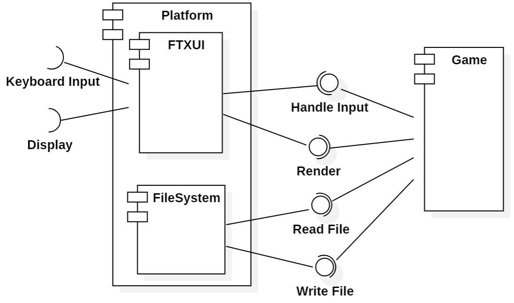
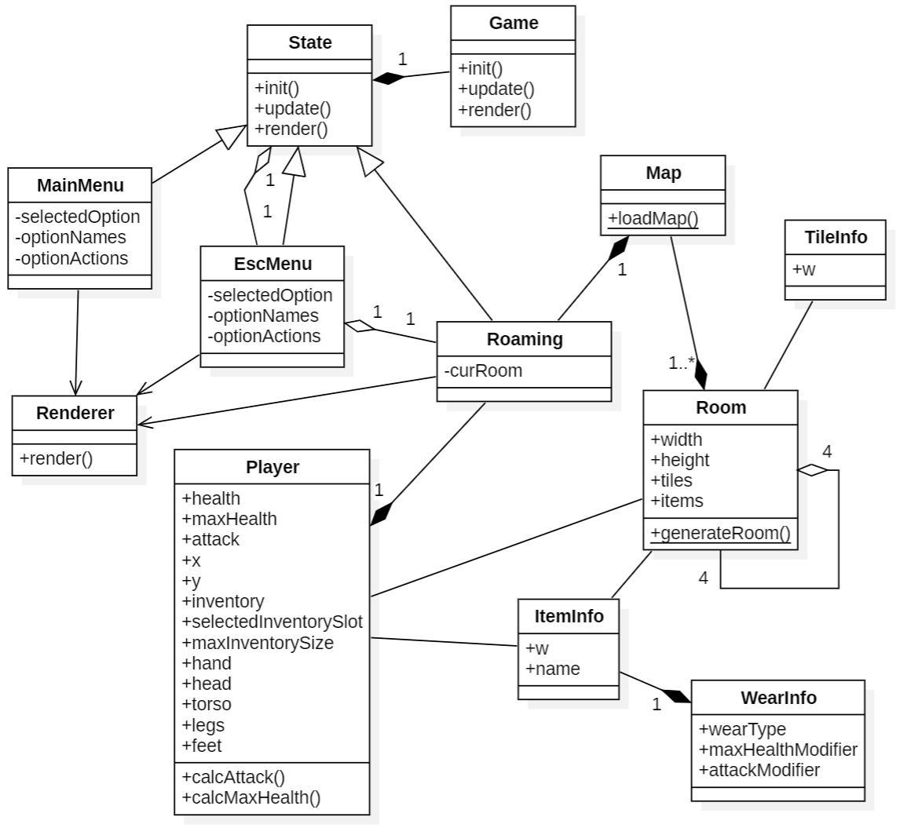

# dice-crawl

## Задание 1

Здесь содержатся сведения, актуальные на момент завершения первого задания. Актуальную информацию можно найти по ссылкам:

- [Сведения о системе](https://docs.google.com/document/d/1unG9svxPcDv9Xq2b-6SPymsjCSKalXPGrgumZO1I_cU/edit)

- [Диаграммы](https://drive.google.com/file/d/15P5IkWYLBsFREomtlkE9_bvMHNHmftu0/view?usp=sharing)

### Общие сведения о системе

Данный документ рассматривает dice-crawl - roguelike игру с консольной графикой, где игрок управляет персонажем, путешествующим по случайно сгенерированному подземелью, представляющему набор соединённых между собой Комнат. Игровой процесс включает в себя исследование комнат, Сражение с мобами, сбор Предметов и снаряжения. Персонаж имеет инвентарь и характеристики, на которые может влиять надетое снаряжение, найденное в комнатах.

### Architectural drivers

todo!()

### Роли и случаи использования

todo!()

### Описание типичного пользователя

todo!()

### Композиция (диаграмма компонентов)

### Логическая структура (диаграмма классов)

