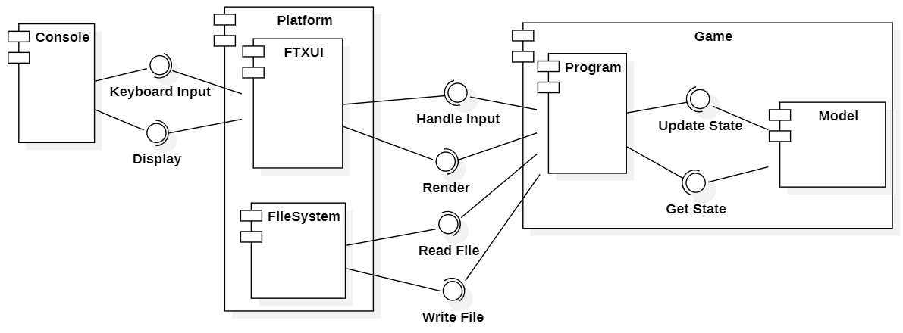
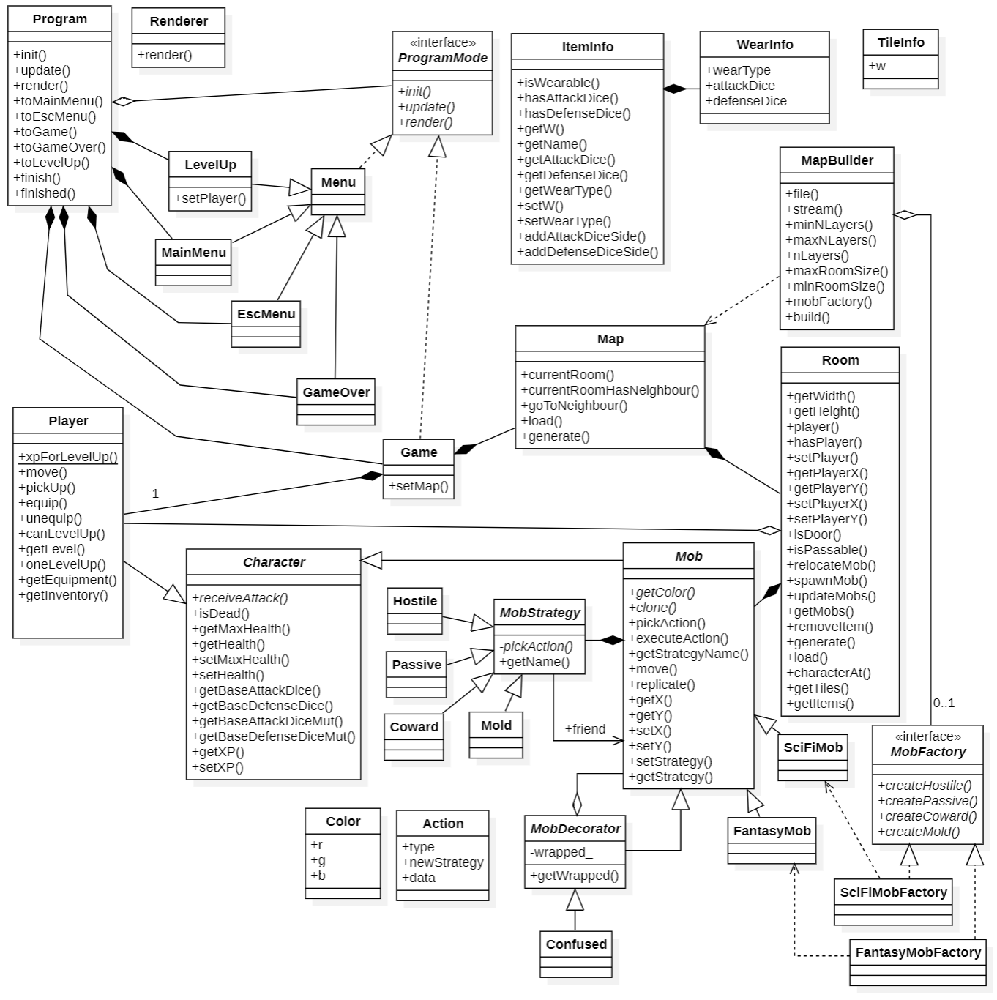

# dice-crawl

## Задание 3

Здесь содержатся сведения, актуальные на момент завершения третьего задания. Актуальную информацию можно найти по ссылкам:

- [Сведения о системе](docs/system_info.md)

- [Диаграммы](https://drive.google.com/file/d/15P5IkWYLBsFREomtlkE9_bvMHNHmftu0/view?usp=sharing)

### Общие сведения о системе

Данный документ рассматривает dice-crawl - roguelike игру с консольной графикой, где игрок управляет персонажем, путешествующим по случайно сгенерированному подземелью, представляющему набор соединённых между собой Комнат. Игровой процесс включает в себя исследование комнат, Сражение с мобами, сбор Предметов и снаряжения. Персонаж имеет инвентарь и характеристики, на которые может влиять надетое снаряжение, найденное в комнатах.

### Architectural drivers

Консольная графика ограничивает возможности  по отрисовке персонажей, особенно если используется рисование посимвольное рисование.

### Роли и случаи использования

- Игрок: Основой пользователь системы, управляет персонажем
- Разработчик уровня: Пользователь, создающий фиксированные уровни, которые загружаются из файлов

### Описание типичного пользователя

- Возраст: 15-35 лет
- Интересы: Любит игры с высокой степенью повторного прохождения, стратегический и/или тактический геймплей
- Опыт: Знаком с основами управления на клавиатуре, предпочитает игры с глубокими механиками и высокой сложностью

### Композиция (диаграмма компонентов)

### Логическая структура (диаграмма классов)

